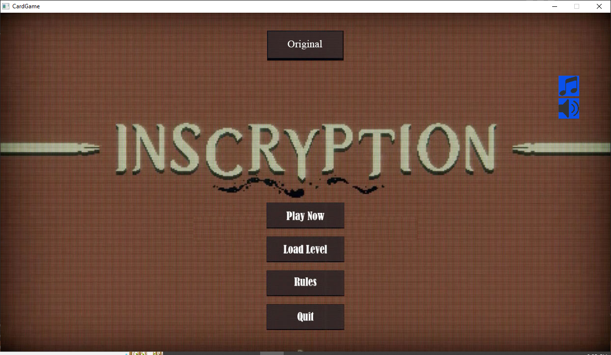
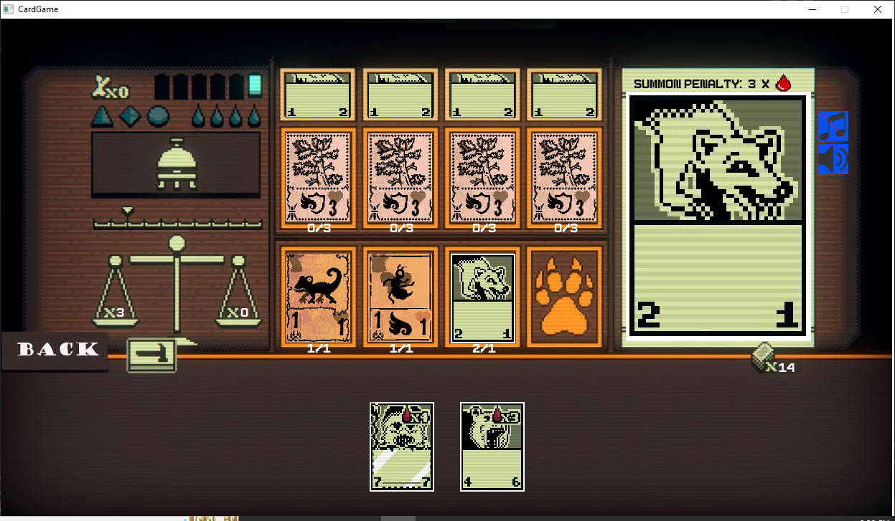
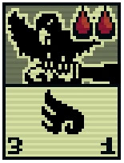

# CardGame
## Introduction
  - Bài tập lớn LTNC.
  - Sinh viên: Nguyễn Tuấn Đức - 21020539.

## Description
  - Dựa trên game Inscryption trên steam.
  - Game triệu hồi thẻ bài thú cùng các kĩ năng đặc biệt để đánh bại thẻ bài đối phương.
  - Khi chênh lệch sát thương nhận của người chơi và máy lớn hơn bằng 5 thì ván đấu sẽ kết thúc.
  - Trò chơi có nhiều level tăng dần độ khó cho người chơi.
  - Nếu qua level thì level tiếp theo sẽ được mở trong Load Level.

## Game feature
  - Có Menu(Chơi ngay, chọn level, hướng dẫn,...).
  - Có tắt bật âm thanh hiệu ứng và nhạc nền riêng biệt cả trong game lẫn ngoài menu.
  - Triệu hồi thẻ bài theo các quy tắc của trò chơi.
  - Load level để chọn màn chơi được mở sau khi đánh bại màn chơi trước đó kể cả sau khi tắt game.

## Image

## Demo
  - Video demo: https://www.youtube.com/watch?v=0tmL8VUE_fc.

## Setup
  - Yêu cầu có Visual Studio Code đã cài extension C/C++ và CodeRunner, đã cài đặt mingw64 và SDL2.
  - B1: Tải về code ngay trên Github bằng cách chọn Download Zip và giải nén.
  - B2: Chỉnh sửa địa chỉ Debugger trong file launch.json và địa chỉ mingw64 trong file task.json trong folder .vscode tùy theo máy.
  - B3: thêm các file .dll vào folder src.
  - B4: Chạy hàm main.cpp bằng F5 để chơi.

## See also
+ Các kĩ thuật trong bài tập:
  - Thư viện SDL2.0 .
  - Lập trình hướng đối tượng.
  - Chia và sắp xếp file.
  - Sử dụng âm thanh, hình ảnh bằng SDL2.0 .
  - Chèn các hoạt ảnh vào trong game.
  - Tạo Menu với các lựa chọn khác nhau.
  - Liên kết với đường link ngoài.
  - Sử dụng đọc/ghi file để ghi lại các sự kiện kể cả khi tắt game.
+ Những điều đã đạt được:
  - Tự tạo ra game đầu tiên của bản thân có thể chơi được.
  - Dành nhiều thời gian tìm hiểu và phát triển sản phẩm của mình.
  - Thành thạo hơn các kỹ thuật class/struct, sử dụng thư viện đồ họa.
+ Nguồn tham khảo và tài nguyên:
  - https://lazyfoo.net/tutorials/SDL/ (các hàm SDL2.0, ...).
  - https://store.steampowered.com/app/1092790/Inscryption/ (Game gốc)
  - https://inscryption.fandom.com/wiki/Inscryption_Wiki (hình ảnh lấy về và photoshop lại)
  - Các hoạt ảnh và âm thanh em lấy trên các nguồn miễn phí khác.
+ Hướng phát triển:
  - Thêm các quân bài với chức năng mới mẻ hơn vào trong game.
  - Tạo thêm nhiều level độc đáo hơn.
  - Thêm các khả năng đặc biệt cho Boss của từng level.
  - Thêm khả năng nâng cấp thẻ bài mỗi khi qua màn cho người chơi.
  - Thêm khả năng thu thập thẻ bài và thay đổi bộ bài cho người chơi.
