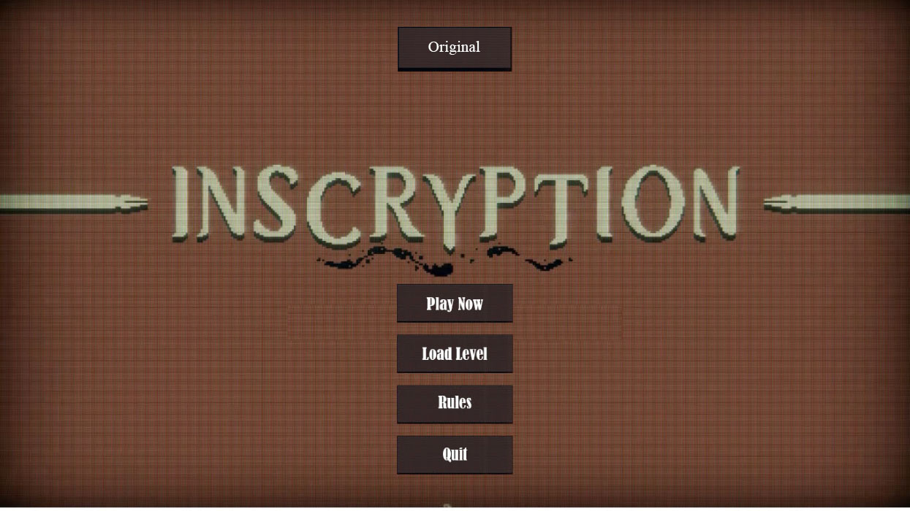

# CardGame
## Introduction
  - Bài tập lớn LTNC.
  - Sinh viên: Nguyễn Tuấn Đức - 21020539.

## Description
  - Dựa trên game Inscryption trên steam.
  - Game triệu hồi thẻ bài thú cùng các kĩ năng đặc biệt để đánh bại thẻ bài đối phương.
  - Khi chênh lệch sát thương nhận của người chơi và máy lớn hơn bằng 5 thì ván đấu sẽ kết thúc.
  - Trò chơi có nhiều level tăng dần độ khó cho người chơi.
  - Nếu qua level thì level tiếp theo sẽ được mở trong Load Level.

## Image

